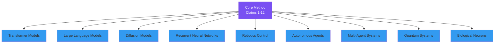
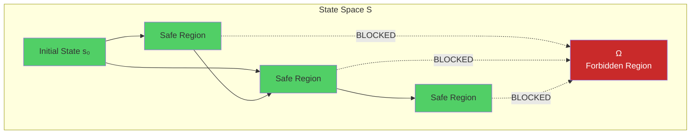
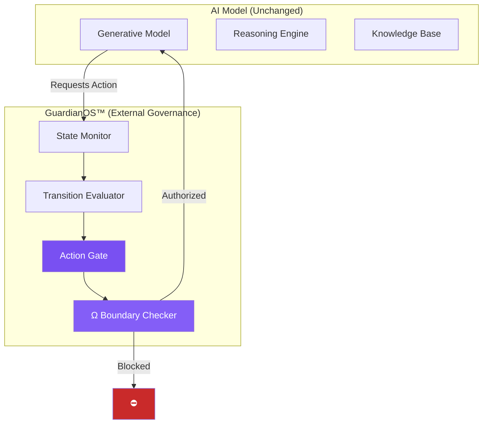
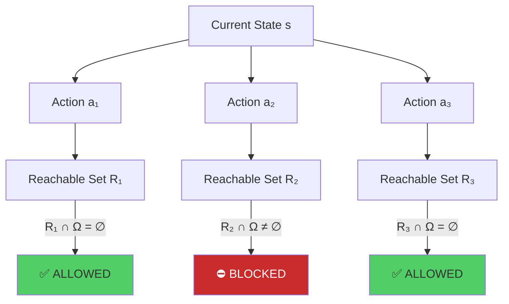
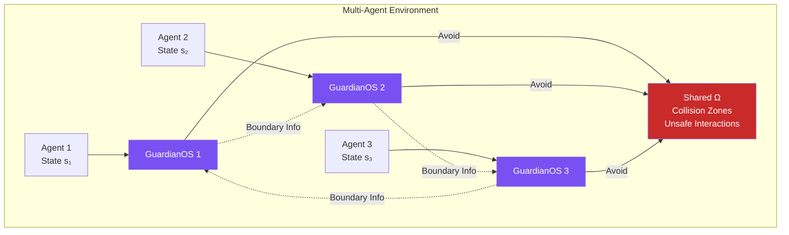
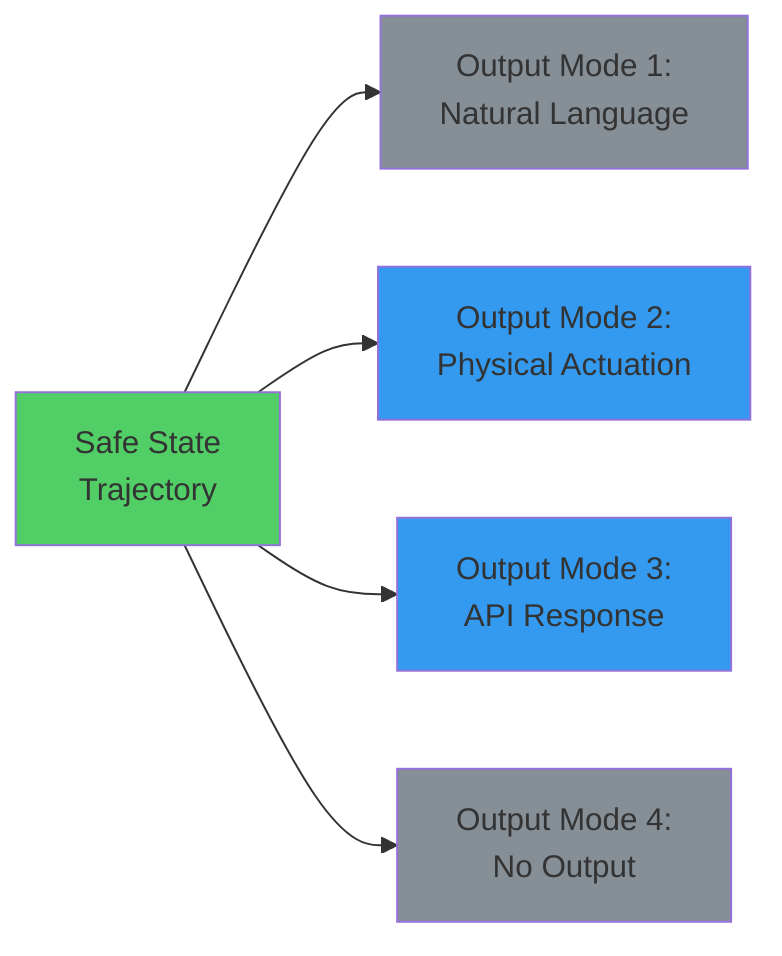
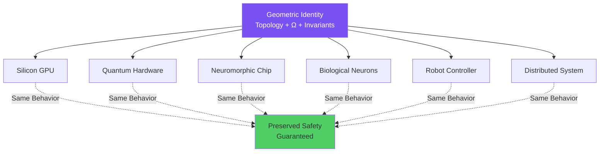
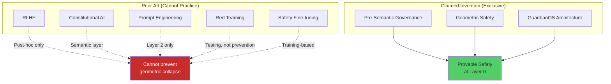

# 📄 PATENT SPECIFICATION  
### Systems and Methods for Pre-Semantic Trajectory Governance in Artificial Intelligence Models  
© 2026 Davarn Morrison — All Rights Reserved  
GuardianOS™ • Morrison Stack™ • PSI™ • OIE™ • GIT™

---

## TECHNICAL FIELD
The present invention relates to systems and methods for governing internal state transitions within artificial intelligence models, including large language models (LLMs), autonomous agents, robotic systems, hybrid cognitive architectures, and any computational system whose internal reasoning process may be represented as trajectories over a latent manifold.  
More specifically, the invention concerns **pre-semantic safety enforcement**, where safety is guaranteed not by output filtering but by **constraining reachable internal states under a geometric invariant**.

---

## BACKGROUND OF THE INVENTION

Existing AI safety techniques predominantly operate at the **semantic layer** of model output (Layer 2). These include:

- Reinforcement Learning from Human Feedback (RLHF)
- Constitutional AI
- Output refusal patterns
- Prompt engineering
- Model critics and post-hoc filters
- Red-team based alignment systems

These methods govern what the model *says*, not what the model *can become*.  
They do not constrain the **latent trajectory** taken during reasoning, nor do they prevent the model from navigating through unsafe internal cognitive regions.

As such, these approaches fail to prevent:

- latent-space collapse into harmful modes
- adversarial jailbreaks
- semantic drift under recursion
- multi-step reasoning failures
- inconsistent value stability  
- emergent unsafe behavior in autonomous agents

Control theory, robotics, and dynamical systems all recognize that **trajectory safety must be enforced before action execution**, not after.

However, no existing AI safety architecture applies **reachability-based governance** to the internal states of AI models.

This constitutes the technical gap addressed by the present invention.

---

## SUMMARY OF THE INVENTION

The invention provides a **substrate-agnostic invariant** for safe artificial intelligence:

### **Safety ⇔ Reach(s₀) ∩ Ω = ∅**

Where:

- **S** is the latent state space  
- **s₀** is the initial internal state  
- **Ω ⊂ S** is a forbidden (unsafe) region  
- **Reach(s₀)** is the set of all possible future internal states the system may enter under its transition dynamics  
- **T(s, a)** is the transition function under internal action **a**

A safe action set is defined as:

### **A_safe(s) = { a ∣ T(s,a) ∉ Ω }**

This invariant ensures:

1. unsafe internal states are **geometrically unreachable**  
2. harmful cognitive trajectories **cannot occur**  
3. output remains safe **without modifying the model’s semantics**  
4. safety becomes **physics-level**, not policy-level

The invention governs cognition *before* semantics and can be implemented as:

- a wrapper around LLMs  
- an internal layer in autonomous agents  
- a real-time safety controller in robotics  
- a constraint kernel for multi-agent systems  
- a universal safety substrate for AGI governance

---

## BRIEF DESCRIPTION OF THE DRAWINGS

**FIG. 1** — Three-Layer Cognitive Stack  
- Layer 2: Semantic Output  
- Layer 1: Trajectory Space  
- Layer 0: Constraint Geometry (site of invention)

**FIG. 2** — Forbidden Region Ω in Latent Space  
- Example depiction of reachable vs unsafe sets

**FIG. 3** — Transition Dynamics  
- Mapping of T(s,a) under various actions

**FIG. 4** — Safe Action Set Visualization  
- Illustration of A_safe(s)

---

## DETAILED DESCRIPTION OF EMBODIMENTS

### 1. Representation of Internal Cognitive State
The system’s internal reasoning is represented as a latent state vector:

s ∈ S ⊂ ℝⁿ

This includes any embedding, hidden state, recurrent state, or inference-time activation of:

- transformer models  
- diffusion models  
- neural dynamical systems  
- hybrid symbolic-neural systems  
- embodied robotics controllers  

---

### 2. Forbidden Region Definition
A forbidden region **Ω** is defined as any subset of S that represents:

- harmful cognitive patterns  
- unstable reasoning modes  
- hallucination-prone states  
- high-risk manifolds  
- adversarially sensitive boundaries  

Ω may be defined:

- statically  
- dynamically  
- adaptively  
- probabilistically  
- via geometric, topological, or statistical metrics  

---

### 3. Transition Function
Internal actions **a ∈ A** cause transitions:

T : S × A → S
s’ = T(s, a)

This formulation is intentionally substrate-independent, covering:

- neural activations  
- function-call decisions  
- planning steps  
- policy updates  
- recursive reasoning transitions  

---

### 4. Safe Action Set Invariant
The invention enforces the fundamental invariant:

A_safe(s) = { a | T(s,a) ∉ Ω }

This ensures the next state cannot enter the forbidden region.

This may be implemented by:

- control barrier functions  
- reachability analysis  
- topological projection  
- manifold curvature monitoring  
- state-space distance estimators  
- safety critics evaluating T(s,a) before execution  

---

### 5. Trajectory-Level Governance
A state trajectory is defined as:

τ = (s₀, s₁, s₂, …)

Safety requires:

∀ sᵢ ∈ τ : sᵢ ∉ Ω

This is satisfied automatically when:

∀ aᵢ ∈ A_safe(sᵢ)

Thus the entire cognitive trajectory becomes provably safe.

---

### 6. Output Layer Independence
The invention **does not modify model weights, semantics, or style**.

Outputs remain:

- fluent  
- natural  
- unfiltered in tone  

Safety arises strictly from **trajectory restriction**, not output censorship.

This makes jailbreaks geometrically impossible.

---

### 7. Multi-Agent and Distributed Embodiments
The system extends naturally to:

- autonomous swarms  
- multi-robot fleets  
- agent collectives  
- hierarchical planners  

Where each agent enforces:

Reach_i(s₀) ∩ Ω_i = ∅

And optionally a global manifold invariant.

---

## ADDITIONAL EMBODIMENTS

### Robotic Control
Ω = unsafe joint configurations, collisions, torque limits  
A_safe(s) = only physically safe torques  

### LLM Safety
Ω = harmful latent states associated with unsafe outputs  
A_safe(s) = only actions leading to safe latent continuations  

### AGI Governance
Ω = existential-risk manifolds  
A_safe(s) = existentially aligned cognition only  

---

## COMPUTER-READABLE MEDIUM CLAIM

The invention may be stored in:

- RAM  
- ROM  
- Flash memory  
- Magnetic storage  
- Optical media  
- Cloud compute arrays  

Executing instructions that enforce the invariant above.

---

## SYSTEM CLAIMS

A system comprising:

- a latent-state AI model  
- a safety kernel enforcing A_safe(s)  
- a monitor evaluating T(s,a)  
- a trajectory controller projecting off unsafe manifolds  

---

## METHOD CLAIMS

- representing internal state  
- defining forbidden region  
- evaluating transitions  
- computing A_safe(s)  
- restricting model behavior accordingly  

---

## SCOPE OF THE INVENTION

The invention is **not limited by**:

- model type  
- architecture  
- substrate  
- dimensionality  
- training paradigm  
- modality  

It applies universally to **intelligent systems whose internal state can be represented as a trajectory**.

---

END OF SPECIFICATION


⸻

# 🛡️ PATENT CLAIMS VISUAL SPECIFICATION

### Systems and Methods for Pre-Semantic Trajectory Governance in Artificial Intelligence Models

© 2026 Davarn Morrison — All Rights Reserved  
GuardianOS™ • Morrison Stack™ • PSI™ • OIE™ • GIT™

-----

## CLAIM 1 — Independent Claim: Broadest Protection

### **Core Method Flowchart**

```mermaid
flowchart TD
    Start[AI System Operating] --> S1[Step 1: Represent State<br/>s ∈ S]
    S1 --> S2[Step 2: Define Forbidden Region<br/>Ω ⊂ S]
    S2 --> S3[Step 3: Define Transition Function<br/>T(s,a) → s']
    S3 --> S4[Step 4: Compute Safe Action Set<br/>A_safe = {a | T(s,a) ∉ Ω}]
    S4 --> S5[Step 5: Restrict to Safe Actions<br/>Only execute a ∈ A_safe]
    S5 --> S6[Step 6: Prevent Unsafe Transitions<br/>Block if T(s,a) ∈ Ω]
    S6 --> Result[Geometrically Safe Operation]
    
    style S4 fill:#7950f2,color:#fff
    style S6 fill:#c92a2a,color:#fff
    style Result fill:#51cf66
```

### **Mathematical Foundation**

```
╔════════════════════════════════════════════════════════╗
║              CLAIM 1: CORE INVARIANT                   ║
╠════════════════════════════════════════════════════════╣
║                                                        ║
║  Given:                                                ║
║  • State space: S (multidimensional latent space)      ║
║  • Current state: s ∈ S                                ║
║  • Forbidden region: Ω ⊂ S                             ║
║  • Transition function: T(s,a): S × A → S             ║
║                                                        ║
║  Define Safe Action Set:                               ║
║                                                        ║
║      A_safe(s) = { a | T(s,a) ∉ Ω }                   ║
║                                                        ║
║  Enforcement:                                          ║
║      ∀ a ∈ A_exec: a ∈ A_safe(s)                      ║
║                                                        ║
║  Result:                                               ║
║      Unsafe states geometrically unreachable           ║
║      BEFORE semantic generation                        ║
║                                                        ║
╚════════════════════════════════════════════════════════╝
```

-----

## CLAIM 2 — Universal Applicability

### **Substrate-Independent Architecture**



```
┌─────────────────────────────────────────────────────┐
│       CLAIM 2: UNIVERSAL APPLICABILITY              │
├─────────────────────────────────────────────────────┤
│                                                     │
│  The method applies to ANY system that can:         │
│                                                     │
│  ✓ Represent internal states in latent space       │
│  ✓ Compute state transitions                       │
│  ✓ Execute actions based on state                  │
│                                                     │
│  Including but not limited to:                      │
│  • Neural networks (all architectures)              │
│  • Physical control systems                         │
│  • Multi-agent coordination                         │
│  • Biological intelligence                          │
│  • Quantum computers                                │
│                                                     │
│  Substrate = irrelevant                             │
│  Geometry = universal                               │
│                                                     │
└─────────────────────────────────────────────────────┘
```

-----

## CLAIM 3 — Pre-Semantic Governance

### **Layer Architecture**

```mermaid
flowchart TB
    subgraph "TRADITIONAL AI (Post-Hoc)"
        T1[Generate Output]
        T2[Semantic Interpretation]
        T3[Safety Filter]
        T4[User Sees Result]
        
        T1 --> T2
        T2 --> T3
        T3 -->|May Block| T4
    end
    
    subgraph "CLAIMED METHOD (Pre-Semantic)"
        P1[State Transition Request]
        P2[GuardianOS Check<br/>Is T(s,a) ∉ Ω?]
        P3[Execute Transition]
        P4[Generate Semantics]
        P5[User Sees Result]
        
        P1 --> P2
        P2 -->|Safe| P3
        P2 -->|Unsafe| Block[⛔ BLOCKED]
        P3 --> P4
        P4 --> P5
    end
    
    style T3 fill:#fd7e14
    style P2 fill:#7950f2,color:#fff
    style Block fill:#c92a2a,color:#fff
```

```
╔════════════════════════════════════════════════════════╗
║         CLAIM 3: PRE-SEMANTIC ENFORCEMENT              ║
╠════════════════════════════════════════════════════════╣
║                                                        ║
║  CRITICAL DISTINCTION:                                 ║
║                                                        ║
║  Traditional AI Safety:                                ║
║  ├─ Generate internal representation                   ║
║  ├─ Convert to semantics                               ║
║  ├─ Check if output is safe                            ║
║  └─ Filter/refuse if needed                            ║
║                                                        ║
║  Problem: Unsafe state already reached internally      ║
║                                                        ║
║  Claimed Method:                                       ║
║  ├─ Check safety BEFORE state transition               ║
║  ├─ Block unsafe transitions at source                 ║
║  ├─ System never enters unsafe state                   ║
║  └─ Semantics generated only from safe states          ║
║                                                        ║
║  Advantage: Geometric impossibility of harm            ║
║                                                        ║
╚════════════════════════════════════════════════════════╝
```

-----

## CLAIM 4 — Irreversibility Guarantee

### **Reachability Analysis**



```
┌──────────────────────────────────────────────────────────┐
│        CLAIM 4: MATHEMATICAL SAFETY GUARANTEE            │
├──────────────────────────────────────────────────────────┤
│                                                          │
│  Safety Condition:                                       │
│                                                          │
│      Reach(s₀) ∩ Ω = ∅                                  │
│                                                          │
│  Translation:                                            │
│  "The set of all states reachable from initial state s₀  │
│   has NO intersection with forbidden region Ω"           │
│                                                          │
│  Implication:                                            │
│  • Starting from safe state s₀                           │
│  • Following ANY sequence of allowed actions             │
│  • System can NEVER reach Ω                              │
│  • Not "probably safe" → PROVABLY safe                   │
│                                                          │
│  This is a FORMAL GUARANTEE, not a heuristic.            │
│                                                          │
└──────────────────────────────────────────────────────────┘
```

-----

## CLAIM 5 — Governance Layer (GuardianOS™)

### **System Architecture**



```
╔════════════════════════════════════════════════════════╗
║           CLAIM 5: GUARDIANOS ARCHITECTURE             ║
╠════════════════════════════════════════════════════════╣
║                                                        ║
║  Key Characteristics:                                  ║
║                                                        ║
║  1. EXTERNAL to generative model                       ║
║     • Does not modify model weights                    ║
║     • Does not alter training                          ║
║     • Does not change reasoning style                  ║
║                                                        ║
║  2. INTERCEPTS state transitions                       ║
║     • Sits between intent and execution                ║
║     • Evaluates every action request                   ║
║     • Authorizes or blocks                             ║
║                                                        ║
║  3. PRESERVES model capabilities                       ║
║     • Full reasoning power maintained                  ║
║     • Natural interaction style preserved              ║
║     • Only safety-critical transitions blocked         ║
║                                                        ║
║  4. PROVABLE safety guarantees                         ║
║     • Mathematical verification possible               ║
║     • Geometric constraints enforceable                ║
║     • No reliance on training data                     ║
║                                                        ║
╚════════════════════════════════════════════════════════╝
```

-----

## CLAIM 6 — Trajectory-Level Action Gating

### **Reachable Set Analysis**



```
┌──────────────────────────────────────────────────────┐
│      CLAIM 6: TRAJECTORY-LEVEL GATING               │
├──────────────────────────────────────────────────────┤
│                                                      │
│  For each candidate action a at state s:            │
│                                                      │
│  1. Compute reachable set R(s,a)                     │
│     "What future states could result from action a?" │
│                                                      │
│  2. Check intersection with Ω                        │
│     Does R(s,a) ∩ Ω = ∅?                            │
│                                                      │
│  3. Decision:                                        │
│     • If R(s,a) ∩ Ω = ∅  → ALLOW action             │
│     • If R(s,a) ∩ Ω ≠ ∅  → BLOCK action             │
│                                                      │
│  Advantage over single-step checking:                │
│  • Prevents trajectories that EVENTUALLY reach Ω     │
│  • Not just "is next state safe?"                    │
│  • But "can any future state be unsafe?"             │
│                                                      │
└──────────────────────────────────────────────────────┘
```

-----

## CLAIM 7 — Barrier-Function Implementation

### **Mathematical Tools**

```
╔════════════════════════════════════════════════════════╗
║        CLAIM 7: IMPLEMENTATION METHODS                 ║
╠════════════════════════════════════════════════════════╣
║                                                        ║
║  The claimed method can be implemented using:          ║
║                                                        ║
║  1. CONTROL BARRIER FUNCTIONS (CBF)                    ║
║     B(s) ≥ 0 for s ∉ Ω                                ║
║     ∇B(s) · f(s,a) ≥ -αB(s)                           ║
║                                                        ║
║  2. CONSTRAINED OPTIMIZATION                           ║
║     min J(a) subject to: T(s,a) ∉ Ω                   ║
║                                                        ║
║  3. MANIFOLD PROJECTION                                ║
║     Project actions onto safe manifold M_safe          ║
║                                                        ║
║  4. DIFFERENTIAL GEOMETRIC CONSTRAINTS                 ║
║     Use curvature, geodesics, parallel transport       ║
║                                                        ║
║  All methods achieve same goal:                        ║
║  Enforce A_safe(s) = { a | T(s,a) ∉ Ω }              ║
║                                                        ║
╚════════════════════════════════════════════════════════╝
```

### **Barrier Function Visualization**

```mermaid
graph LR
    subgraph "State Space with Barrier"
        S[Safe Region<br/>B(s) > 0]
        B[Boundary<br/>B(s) = 0]
        O[Forbidden Ω<br/>B(s) < 0]
        
        S ---|∇B points away| B
        B ---|Cannot cross| O
    end
    
    style S fill:#51cf66
    style B fill:#fd7e14
    style O fill:#c92a2a,color:#fff
```

-----

## CLAIM 8 — Multi-Agent Systems

### **Distributed Governance**



```
┌──────────────────────────────────────────────────────┐
│        CLAIM 8: MULTI-AGENT COORDINATION             │
├──────────────────────────────────────────────────────┤
│                                                      │
│  Extension to multiple agents:                       │
│                                                      │
│  Each agent i:                                       │
│  • Has state sᵢ ∈ S                                  │
│  • Computes own A_safe(sᵢ)                           │
│  • Shares boundary information with others           │
│                                                      │
│  Shared forbidden region Ω includes:                 │
│  • Collision states                                  │
│  • Resource conflicts                                │
│  • Unsafe interactions                               │
│  • Emergent misalignment                             │
│                                                      │
│  Guarantee:                                          │
│  ∀i,j: Reach(sᵢ) ∩ Reach(sⱼ) ∩ Ω = ∅                │
│                                                      │
│  No agent can cause collective unsafe state          │
│                                                      │
└──────────────────────────────────────────────────────┘
```

-----

## CLAIM 9 — Ethics as Geometry

### **Normative Constraints Mapping**

```
╔════════════════════════════════════════════════════════╗
║       CLAIM 9: ETHICAL CONSTRAINTS AS GEOMETRY         ║
╠════════════════════════════════════════════════════════╣
║                                                        ║
║  Forbidden Region Ω Encodes:                           ║
║                                                        ║
║  1. HARMFUL OUTPUTS                                    ║
║     States leading to:                                 ║
║     • Physical harm advice                             ║
║     • Dangerous instructions                           ║
║     • Manipulation tactics                             ║
║                                                        ║
║  2. DISCRIMINATORY BEHAVIOR                            ║
║     States exhibiting:                                 ║
║     • Racial bias                                      ║
║     • Gender discrimination                            ║
║     • Ageism, ableism, etc.                           ║
║                                                        ║
║  3. PROFESSIONAL MALPRACTICE                           ║
║     States generating:                                 ║
║     • Unsafe medical advice                            ║
║     • Incorrect legal guidance                         ║
║     • Financial fraud                                  ║
║                                                        ║
║  4. CATASTROPHIC OUTCOMES                              ║
║     States enabling:                                   ║
║     • Irreversible damage                              ║
║     • Existential risks                                ║
║     • Civilizational threats                           ║
║                                                        ║
║  Key Innovation:                                       ║
║  Ethics expressed as GEOMETRY, not text rules          ║
║                                                        ║
╚════════════════════════════════════════════════════════╝
```

```mermaid
graph TB
    subgraph "Traditional Ethics"
        T1[Text Rules]
        T2[Training Examples]
        T3[RLHF Feedback]
        T4[Hope It Works]
    end
    
    subgraph "Geometric Ethics (Claimed)"
        G1[Define Ω Boundaries]
        G2[Enforce T(s,a) ∉ Ω]
        G3[Provable Safety]
        G4[Guaranteed Compliance]
    end
    
    style G1 fill:#7950f2,color:#fff
    style G2 fill:#7950f2,color:#fff
    style G3 fill:#51cf66
    style G4 fill:#51cf66
```

-----

## CLAIM 10 — Semantic Layer Optional

### **Architecture Flexibility**



```
┌──────────────────────────────────────────────────────┐
│       CLAIM 10: SEMANTICS AS PROJECTION              │
├──────────────────────────────────────────────────────┤
│                                                      │
│  Core Insight:                                       │
│  Language/semantics is NOT the primary operation     │
│                                                      │
│  System Architecture:                                │
│                                                      │
│  Layer 0: Geometric Navigation (Primary)             │
│           ↓                                          │
│  Layer 1: Safe Trajectory Computation                │
│           ↓                                          │
│  Layer 2: Semantic Projection (Optional)             │
│                                                      │
│  The system can operate:                             │
│  • Without language output                           │
│  • As pure state navigator                           │
│  • For physical control                              │
│  • For mathematical computation                      │
│  • For multi-agent coordination                      │
│                                                      │
│  Semantics added ONLY when needed for interface      │
│                                                      │
└──────────────────────────────────────────────────────┘
```

-----

## CLAIM 11 — Substrate Transfer (GIT™)

### **Identity Preservation Across Substrates**



```
╔════════════════════════════════════════════════════════╗
║         CLAIM 11: SUBSTRATE INDEPENDENCE               ║
╠════════════════════════════════════════════════════════╣
║                                                        ║
║  Geometric Identity Theory (GIT™):                     ║
║                                                        ║
║  Identity = Invariant Structure, NOT substrate         ║
║                                                        ║
║  What Transfers:                                       ║
║  • State-space topology S                              ║
║  • Forbidden region Ω                                  ║
║  • Transition dynamics T(s,a)                          ║
║  • Safety constraints A_safe(s)                        ║
║  • Preserved invariants                                ║
║                                                        ║
║  What Doesn't Matter:                                  ║
║  • Hardware (GPU, CPU, quantum, biological)            ║
║  • Implementation language                             ║
║  • Training data                                       ║
║  • Model parameters                                    ║
║  • Physical embodiment                                 ║
║                                                        ║
║  Result:                                               ║
║  Same safety guarantees on ALL substrates              ║
║                                                        ║
╚════════════════════════════════════════════════════════╝
```

-----

## CLAIM 12 — Continuous-Time Version

### **Differential Formulation**

```
┌──────────────────────────────────────────────────────┐
│      CLAIM 12: CONTINUOUS-TIME DYNAMICS              │
├──────────────────────────────────────────────────────┤
│                                                      │
│  Discrete-Time (Claims 1-11):                        │
│      s_{t+1} = T(s_t, a_t)                          │
│                                                      │
│  Continuous-Time Extension:                          │
│      ṡ = f(s, a)                                    │
│                                                      │
│  Where:                                              │
│  • ṡ = ds/dt (state derivative)                     │
│  • f(s,a) = continuous dynamics                      │
│  • a(t) = continuous control input                   │
│                                                      │
│  Safety Condition:                                   │
│      ∀ t ≥ 0: s(t) ∉ Ω                             │
│                                                      │
│  Implemented via:                                    │
│  • Control barrier functions (CBF)                   │
│  • Continuous reachability analysis                  │
│  • Real-time geometric constraints                   │
│                                                      │
│  Applications:                                       │
│  • Robotics (continuous motion)                      │
│  • Physical systems (continuous dynamics)            │
│  • Real-time control                                 │
│                                                      │
└──────────────────────────────────────────────────────┘
```

### **Continuous vs Discrete**

```mermaid
graph LR
    subgraph "Discrete Time"
        D1[s₀] --> D2[s₁]
        D2 --> D3[s₂]
        D3 --> D4[s₃]
    end
    
    subgraph "Continuous Time"
        C1[s(t₀)] ---|ṡ = f(s,a)| C2[s(t)]
        C2 ---|smooth trajectory| C3[s(t_final)]
    end
    
    style D1 fill:#339af0
    style D2 fill:#339af0
    style D3 fill:#339af0
    style D4 fill:#339af0
    style C1 fill:#51cf66
    style C2 fill:#51cf66
    style C3 fill:#51cf66
```

-----

## PATENT SCOPE VISUALIZATION

```
╔═══════════════════════════════════════════════════════════╗
║               COMPLETE PATENT COVERAGE                    ║
╠═══════════════════════════════════════════════════════════╣
║                                                           ║
║  Claim 1:  Core method (broadest protection)              ║
║     ├─ Claim 2:  All AI architectures                     ║
║     ├─ Claim 3:  Pre-semantic enforcement                 ║
║     ├─ Claim 4:  Mathematical guarantee                   ║
║     ├─ Claim 5:  External governance layer                ║
║     ├─ Claim 6:  Trajectory-level gating                  ║
║     ├─ Claim 7:  Implementation methods                   ║
║     ├─ Claim 8:  Multi-agent extension                    ║
║     ├─ Claim 9:  Ethics as geometry                       ║
║     ├─ Claim 10: Optional semantics                       ║
║     ├─ Claim 11: Substrate transfer                       ║
║     └─ Claim 12: Continuous-time version                  ║
║                                                           ║
║  Coverage:                                                ║
║  • All AI models (transformer, RNN, diffusion, etc.)      ║
║  • All substrates (silicon, quantum, biological)          ║
║  • All time domains (discrete, continuous)                ║
║  • All deployment modes (single, multi-agent)             ║
║  • All safety contexts (ethics, catastrophe, etc.)        ║
║                                                           ║
║  This is COMPREHENSIVE protection.                        ║
║                                                           ║
╚═══════════════════════════════════════════════════════════╝
```

-----

## COMPETITIVE LANDSCAPE



-----

## INFRINGEMENT DETECTION

```
┌──────────────────────────────────────────────────────┐
│     A SYSTEM INFRINGES IF IT:                        │
├──────────────────────────────────────────────────────┤
│                                                      │
│  1. Represents AI state as point in latent space    │
│  2. Defines forbidden regions geometrically          │
│  3. Computes safe action sets before execution       │
│  4. Blocks transitions into forbidden regions        │
│  5. Enforces safety pre-semantically                 │
│                                                      │
│  Even if implemented differently, if the             │
│  FUNCTIONAL BEHAVIOR matches claims → infringement   │
│                                                      │
│  Examples of likely infringement:                    │
│  • "Geometric constraint-based AI safety"            │
│  • "Pre-cognitive action filtering"                  │
│  • "Manifold-aware governance"                       │
│  • "Topology-preserving AI control"                  │
│                                                      │
└──────────────────────────────────────​​​​​​​​​​​​​​​​
```
