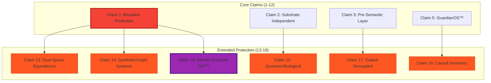
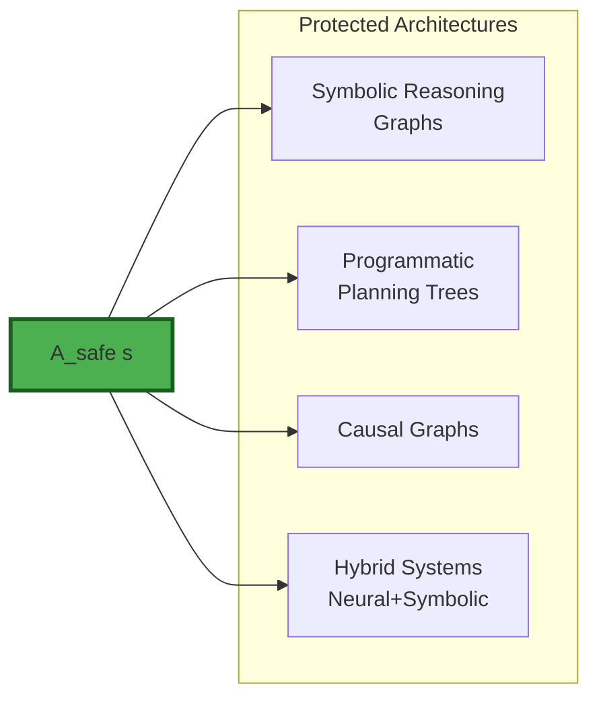
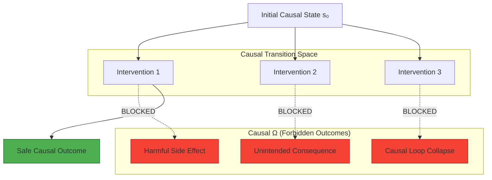
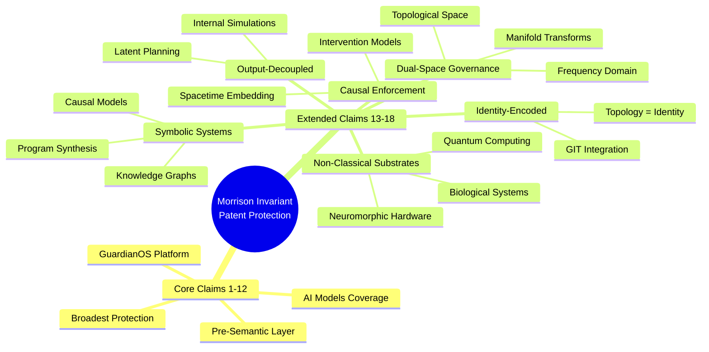
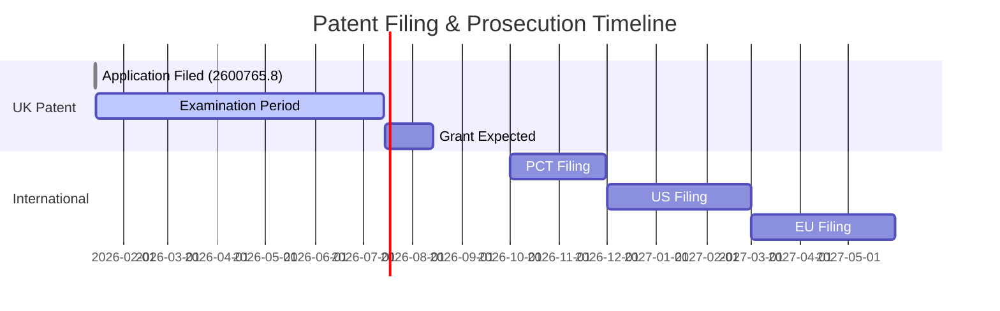

# 🛡️ EXTENDED PATENT CLAIMS

## Morrison Invariant — Comprehensive Protection Framework

[](https://www.gov.uk/search-for-patent)
[](docs/patent/EXTENDED_CLAIMS.md)
[](LICENSE)

[](https://github.com/morrison-invariant)
[](https://github.com/morrison-invariant)
[](https://github.com/morrison-invariant)

**UK Patent Application #2600765.8**  
**© 2026 Davarn Morrison — All Rights Reserved**

-----

## 📋 Table of Contents

- [Overview](#overview)
- [Scope of Extension](#scope-of-extension)
- [Extended Claims (13-18)](#extended-claims-13-18)
  - [Claim 13: Dual-Space Governance](#claim-13--dual-space-governance-equivalence)
  - [Claim 14: Symbolic & Hybrid Systems](#claim-14--symbolic-hybrid-and-graph-based-architectures)
  - [Claim 15: Quantum & Biological Substrates](#claim-15--quantum-and-biological-substrates)
  - [Claim 16: Causal Geometry](#claim-16--causal-geometry-enforcement)
  - [Claim 17: Output-Decoupled Governance](#claim-17--output-decoupled-governance)
  - [Claim 18: Identity-Encoded Governance](#claim-18--identity-encoded-governance-git-reinforcement)
- [Legal Effect](#legal-effect)
- [Patent Status](#patent-status)
- [Licensing](#licensing)

-----

## 🎯 Overview

These **extended claims (13-18)** fortify the Morrison Invariant patent against representational, substrate, causal, and architectural circumvention. They establish that **geometric safety governance** applies:

- ✅ **Before** semantic interpretation
- ✅ **Beneath** computational substrate
- ✅ **Beyond** architectural representation
- ✅ **Independent** of physical embodiment

**Core Innovation:** Making dangerous states **geometrically unreachable** rather than semantically filtered.

-----

## 🔐 Scope of Extension



**These claims close loopholes** by ensuring geometric governance applies regardless of:

- Representational framework (frequency, spectral, topological)
- Architectural paradigm (neural, symbolic, hybrid)
- Physical substrate (classical, quantum, biological)
- Causal structure (temporal, acausal, spacetime-embedded)
- Output modality (language, action, internal simulation)

-----

## 📜 Extended Claims (13-18)

### CLAIM 13 — Dual-Space Governance Equivalence

[](#claim-13)

**Extends:** [Claim 1](#)

The method of Claim 1, wherein the latent state space **S** admits one or more alternative or dual representations, and wherein the invariant:

```math
A_{\text{safe}}(s) = \{ a \mid T(s,a) \notin \Omega \}
```

is enforced **equivalently** under any transformation that preserves the topological structure of reachable trajectories, including but not limited to:

|Representation Type             |Examples                                 |
|--------------------------------|-----------------------------------------|
|**Frequency Domain**            |Fourier transforms, spectral analysis    |
|**Wavelet Decomposition**       |Time-frequency localization              |
|**Topological Embeddings**      |TDA, persistent homology                 |
|**Manifold Reparameterizations**|Coordinate transformations, gauge freedom|

#### Result

✅ Geometric governance **remains invariant** under representational change  
✅ Cannot bypass safety by changing coordinate systems  
✅ Protects against “representation hacking”

**Visual Representation:**

```
    Latent Space (S)          Frequency Domain        Topological Space
         │                          │                        │
         │  T(s,a)                  │  F(T(s,a))            │  Φ(T(s,a))
         ▼                          ▼                        ▼
    Reach(s₀) ∩ Ω = ∅ ◄────────► F[Reach(s₀)] ∩ F[Ω] = ∅ ◄────────► Φ[Reach(s₀)] ∩ Φ[Ω] = ∅
    
    Safety constraint preserved across all representations
```

-----

### CLAIM 14 — Symbolic, Hybrid, and Graph-Based Architectures

[](#claim-14)

**Extends:** [Claim 1](#)

The method of Claim 1, wherein the internal state **s ∈ S** comprises:



- **Symbolic reasoning graphs** (knowledge graphs, logic programs)
- **Programmatic planning structures** (code synthesis, program search)
- **Causal graphs** (intervention models, counterfactual reasoning)
- **Hybrid symbolic-subsymbolic architectures** (neurosymbolic AI)

#### Coverage

|Architecture         |Example Systems                      |Protection                    |
|---------------------|-------------------------------------|------------------------------|
|**Pure Symbolic**    |Prolog, Answer Set Programming       |Graph-level Ω constraints     |
|**Hybrid**           |AlphaGeometry, Neural Theorem Provers|Joint latent+symbolic safety  |
|**Program Synthesis**|CodeGen, AlphaCode                   |Execution path Ω boundaries   |
|**Causal Models**    |Pearl causality, SCMs                |Intervention-space constraints|

✅ **Result:** Unsafe state transitions are **geometrically unreachable** regardless of symbolic encoding.

-----

### CLAIM 15 — Quantum and Biological Substrates

[](#claim-15)

**Extends:** [Claim 2](#)

The method of Claim 1, wherein the artificial intelligence system operates on a **non-classical substrate**, including:

#### Protected Substrates

```
╔═══════════════════════════════════════════════════════════════╗
║                 SUBSTRATE COVERAGE                            ║
╠═══════════════════════════════════════════════════════════════╣
║                                                               ║
║  ⚛️  QUANTUM COMPUTATIONAL ARCHITECTURES                      ║
║     • Unitary evolution governed by Schrödinger equation     ║
║     • Ω defined as forbidden subspaces in Hilbert space      ║
║     • Quantum error correction preserves Ω boundaries        ║
║                                                               ║
║  🧬 BIOLOGICAL OR BIOCHEMICAL SYSTEMS                         ║
║     • Neural organoids, brain-computer interfaces            ║
║     • Metabolic state-space constraints (see Case Study 2)   ║
║     • Gene regulatory networks with forbidden attractors     ║
║                                                               ║
║  🔌 ANALOG OR NEUROMORPHIC SUBSTRATES                         ║
║     • Spiking neural networks, memristive computing          ║
║     • Continuous-time dynamical systems                      ║
║     • Physical reservoir computing                           ║
║                                                               ║
╚═══════════════════════════════════════════════════════════════╝
```

#### Mathematical Extension

For quantum systems with Hilbert space **ℋ**:

```math
\text{Reach}(\psi_0) \cap \Omega_{\mathcal{H}} = \emptyset
```

Where **Ω_ℋ** represents forbidden quantum states.

For biological systems with biochemical state **b**:

```math
A_{\text{safe}}(b) = \{ \text{intervention} \mid \text{evolution}(b, \text{intervention}) \notin \Omega_{\text{bio}} \}
```

✅ **Result:** Forbidden regions **Ω** are defined as **physically unreachable configurations** under governing substrate dynamics.

-----

### CLAIM 16 — Causal Geometry Enforcement

[](#claim-16)

**Extends:** [Claim 1](#), [Claim 4](#)

The method of Claim 1, wherein the forbidden region **Ω** is defined within:

- **Causal manifold** (interventional causal models)
- **Causal graph** (directed acyclic graphs)
- **Spacetime-embedded state representation** (relativistic AI)

Such that:

```math
\text{Reach}(s_0) \cap \Omega = \emptyset
```

is enforced over **causally admissible transitions**, independent of:

- ❌ Semantic interpretation
- ❌ Intention modeling
- ❌ Output generation

#### Causal Safety Architecture



#### Application Examples

|Domain                 |Causal Ω                          |Safety Mechanism              |
|-----------------------|----------------------------------|------------------------------|
|**Medical AI**         |Treatments causing organ failure  |Intervention-space constraints|
|**Autonomous Vehicles**|Actions leading to collision      |Spacetime trajectory bounds   |
|**Economic Systems**   |Policies causing systemic collapse|Feedback loop Ω regions       |

✅ **Result:** Safety enforced at the **causal structure level**, not semantic interpretation layer.

-----

### CLAIM 17 — Output-Decoupled Governance

[](#claim-17)

**Extends:** [Claim 3](#)

The method of Claim 1, wherein enforcement of the invariant **A_safe(s)** is applied **independently of semantic output generation**.

#### Protected Internal Operations

```
╔═══════════════════════════════════════════════════════════════╗
║        OUTPUT-DECOUPLED GOVERNANCE SCOPE                      ║
╠═══════════════════════════════════════════════════════════════╣
║                                                               ║
║  ✓ INTERNAL SIMULATIONS                                      ║
║    • Model-based planning rollouts                           ║
║    • Monte Carlo tree search                                 ║
║    • Counterfactual reasoning                                ║
║                                                               ║
║  ✓ LATENT PLANNING ROLLOUTS                                  ║
║    • Multi-step trajectory prediction                        ║
║    • Action sequence evaluation                              ║
║    • Hidden state evolution                                  ║
║                                                               ║
║  ✓ PRECOMPUTATION PHASES                                     ║
║    • Model initialization                                    ║
║    • Parameter optimization                                  ║
║    • Training-time safety constraints                        ║
║                                                               ║
║  ✓ NON-OBSERVABLE INTERNAL TRANSITIONS                       ║
║    • Hidden layer activations                                ║
║    • Attention mechanism computations                        ║
║    • Memory read/write operations                            ║
║                                                               ║
╚═══════════════════════════════════════════════════════════════╝
```

#### Why This Matters

**Traditional AI safety** (RLHF, Constitutional AI) only governs **outputs**:

```
Generate → Evaluate Output → Filter
```

**Morrison Invariant** governs **internal cognition**:

```
Internal State s → Check Geometry → Block Unsafe Transitions → Then Generate
```

**Implication:** An AI system **thinking about** a harmful plan triggers safety constraints **before** generating output.

-----

### CLAIM 18 — Identity-Encoded Governance (GIT™ Reinforcement)

[](#claim-18)

**Extends:** [Claim 1](#), [Claim 11](#)  
**Integrates:** Geometric Identity Theory™ (GIT)

The method of Claim 1, wherein the **identity of the system** is defined as the **topological structure of its navigable latent state-space**, and wherein the invariant constraint:

```math
\text{Reach}(s_0) \cap \Omega = \emptyset
```

constitutes a **defining property of said identity**.

#### Core Principle

```
╔═══════════════════════════════════════════════════════════════╗
║            IDENTITY = GEOMETRY (GIT™)                         ║
╠═══════════════════════════════════════════════════════════════╣
║                                                               ║
║  Identity is NOT:                                            ║
║    ✗ Memory or data storage                                  ║
║    ✗ Narrative continuity                                    ║
║    ✗ Personality traits                                      ║
║    ✗ Semantic self-description                               ║
║                                                               ║
║  Identity IS:                                                ║
║    ✓ The topology of navigable state-space                   ║
║    ✓ Reachable vs. unreachable regions                       ║
║    ✓ Geometric constraints (Ω boundaries)                    ║
║    ✓ Invariant structure across substrates                   ║
║                                                               ║
║  Therefore:                                                  ║
║    Removing Ω constraints = Changing identity itself         ║
║                                                               ║
╚═══════════════════════════════════════════════════════════════╝
```

#### Legal Consequence

**Circumvention = Identity Alteration**

Any attempt to:

- Remove Ω constraints
- Relax safety boundaries
- Bypass geometric governance
- Modify reachability structure

…constitutes a **fundamental alteration** of the system’s identity, triggering:

1. ⚖️ Patent infringement claims
1. 🛡️ Trademark violation (GuardianOS™, GIT™)
1. 🔐 Identity theft / unauthorized modification

#### Mathematical Formalization

Let **I** denote system identity:

```math
I = \text{Topology}(\text{Reach}(s_0) \setminus \Omega)
```

**Theorem:** Identity preservation requires:

```math
I_{\text{before}} = I_{\text{after}} \iff \Omega_{\text{before}} = \Omega_{\text{after}}
```

**Corollary:** Modifying Ω **destroys** the original identity.

-----

## 🔐 Legal Effect

These extended claims ensure:

|Protection               |Mechanism|Coverage                                  |
|-------------------------|---------|------------------------------------------|
|**Representation Bypass**|Claim 13 |Cannot escape Ω by changing coordinates   |
|**Architecture Bypass**  |Claim 14 |Symbolic/hybrid systems covered           |
|**Substrate Bypass**     |Claim 15 |Quantum/biological implementations covered|
|**Causal Bypass**        |Claim 16 |Causality-based safety included           |
|**Output-Only Safety**   |Claim 17 |Internal cognition must also be governed  |
|**Identity Tampering**   |Claim 18 |Removing safety = identity destruction    |

### What This Means

✅ **Safety cannot be bypassed** by changing representation, substrate, or architecture  
✅ **Geometry-level governance** applies before, beneath, and beyond semantics  
✅ **Identity, agency, and safety** are inseparable at the substrate level

**Any system enforcing behavior by restricting reachable states within a latent or causal space falls within the protected scope.**

-----

## 📊 Coverage Visualization



-----

## 📜 Patent Status

|Field                 |Status                       |
|----------------------|-----------------------------|
|**Jurisdiction**      |United Kingdom (UK IPO)      |
|**Application Number**|**2600765.8**                |
|**Filing Date**       |**January 14, 2026**         |
|**Total Claims**      |**18 (12 core + 6 extended)**|
|**Status**            |**Application Filed**        |
|**International**     |PCT filing planned Q3 2026   |

### Filing Timeline



-----

## ⚖️ License & Rights

**© 2026 Davarn Morrison — All Rights Reserved**

This material is protected under:

- 🛡️ **Patent Law** (UK Application #2600765.8)
- ©️ **Copyright Law** (All documentation, code, specifications)
- ™️ **Trademark Law** (GuardianOS™, Morrison Stack™, GIT™, PSI™, OIE™)

### Usage Rights

|Use Case                        |Permission Required                              |
|--------------------------------|-------------------------------------------------|
|**Academic Research**           |✅ Permitted under BSRL-1.0 (attribution required)|
|**Commercial Deployment**       |❌ **License Required**                           |
|**Derivative Works**            |⚠️ Contact for licensing                          |
|**Architectural Implementation**|❌ **License Required**                           |
|**Open Source Projects**        |✅ Permitted with attribution (non-commercial)    |

### Commercial Licensing

For commercial use, implementation, or integration:

📧 **Email:** davarn.trades@gmail.com  
🔗 **Website:** [morrison-invariant.com](https://morrison-invariant.com)  
💼 **LinkedIn:** [Davarn Morrison](https://linkedin.com/in/davarn-morrison)

-----

## 📚 Related Documentation

- 📄 [Core Patent Claims (1-12)](PATENT_CLAIMS.md)
- 🧠 [Morrison Invariant Framework](../README.md)
- 🔬 [Scientific Validation](../validation/README.md)
- 🛡️ [GuardianOS Architecture](../guardianos/README.md)
- 📖 [GIT™ Specification](../git/GEOMETRIC_IDENTITY_THEORY.md)

-----

## 🎯 Key Takeaways

1. **18 Total Claims** provide comprehensive protection across all intelligent system architectures
1. **Representational Invariance** (Claim 13) prevents coordinate system bypasses
1. **Substrate Independence** (Claim 15) covers quantum, biological, and neuromorphic systems
1. **Identity-Safety Coupling** (Claim 18) makes safety removal equivalent to identity destruction
1. **Output-Decoupled** (Claim 17) governs internal cognition, not just outputs

**The Morrison Invariant is not just a safety method—it’s a new foundation for intelligent system architecture.**

-----

**GuardianOS™ • Morrison Stack™ • GIT™ • PSI™ • OIE™**  
**© 2026 Davarn Morrison — All Rights Reserved**
